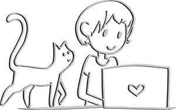

####  I'm Vivi, beginner programmer, cat-lover, and beer enthusiast.　|  　猫・ビール好きの初心者プログラマーViviです。

---------

####  🔭 I’m currently working on: Nyanbiki, a cat counter　game using AWS Rekognition.　|  Nyanbiki, AWSのRekognitionを使って猫ちゃんを数えるゲーム

#### 🌱 I’m currently studying: PyTest and studying for AWS CSAA　| 　PyTestの使い方・AWS CSAAを向けて勉強中

#### 💬 Ask me about: Cat rescue and adoption in the Greater Tokyo Area 　| 　 都内の保護猫活動。

<!--
**vivi-and-tea/vivi-and-tea** is a ✨ _special_ ✨ repository because its `README.md` (this file) appears on your GitHub profile.

Here are some ideas to get you started:

- 🔭 I’m currently working on ...
- 🌱 I’m currently learning ...
- 👯 I’m looking to collaborate on ...
- 🤔 I’m looking for help with ...
- 💬 Ask me about ...
- 📫 How to reach me: ...
- 😄 Pronouns: ...
- ⚡ Fun fact: ...
-->
